# MugurluApp

### This project will be an example of a full fledged CMS and E-commerce app with many facilities implemented.

## technologies

Laravel 8x for backend

Tailwind for styling

## Credit

https://undraw.co/

https://www.tailwindtoolbox.com/

## Mockups

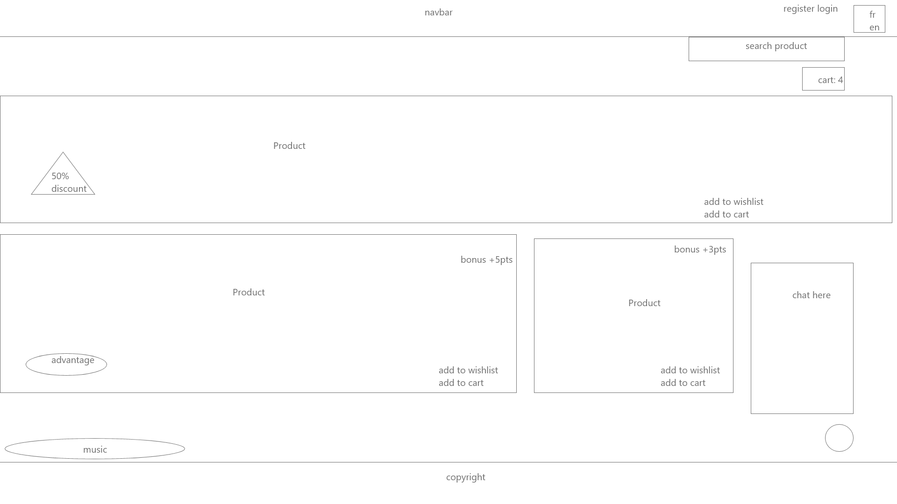
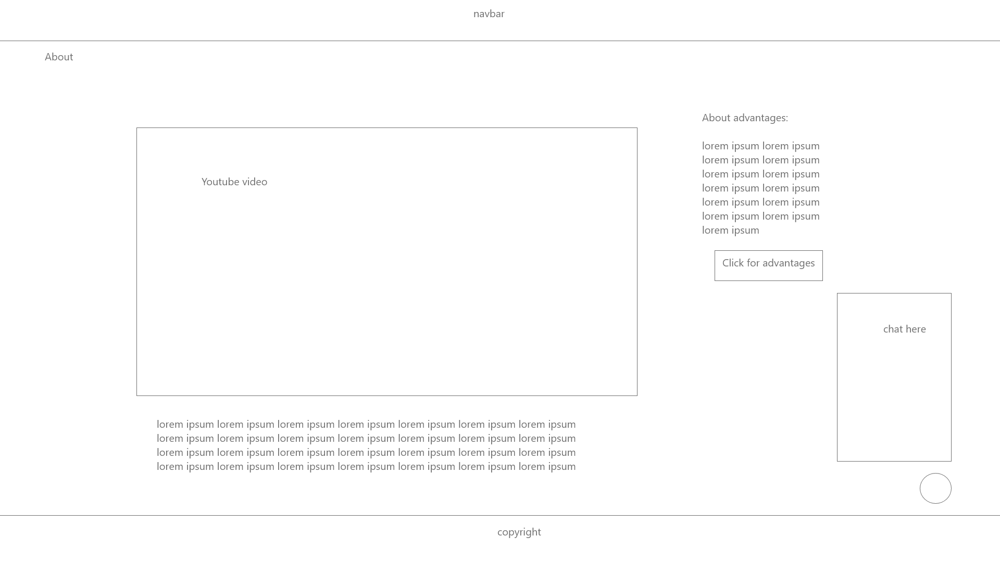
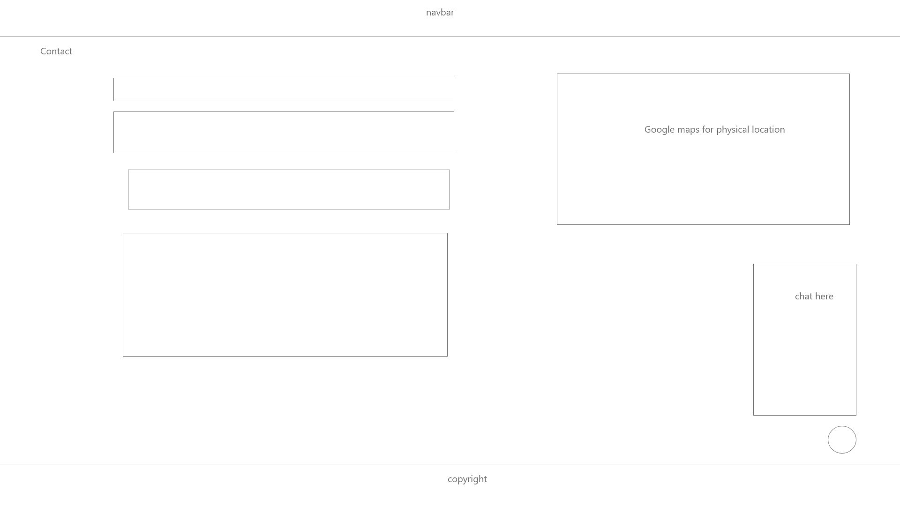
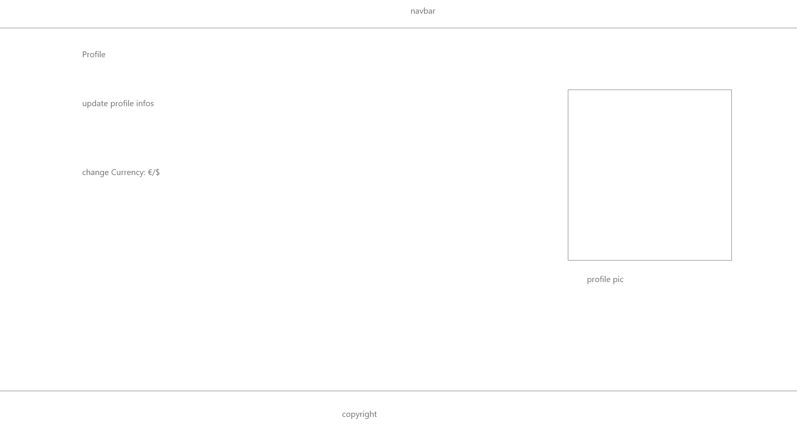
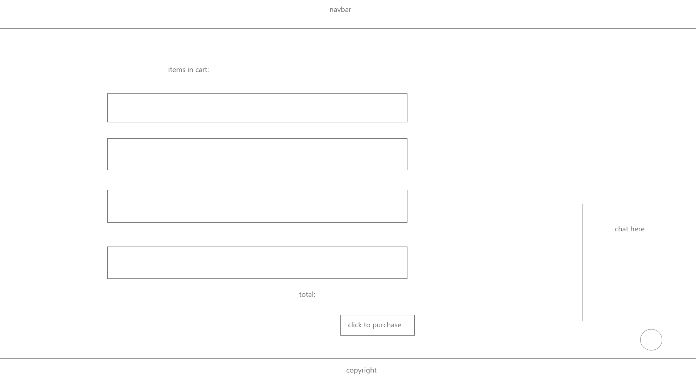
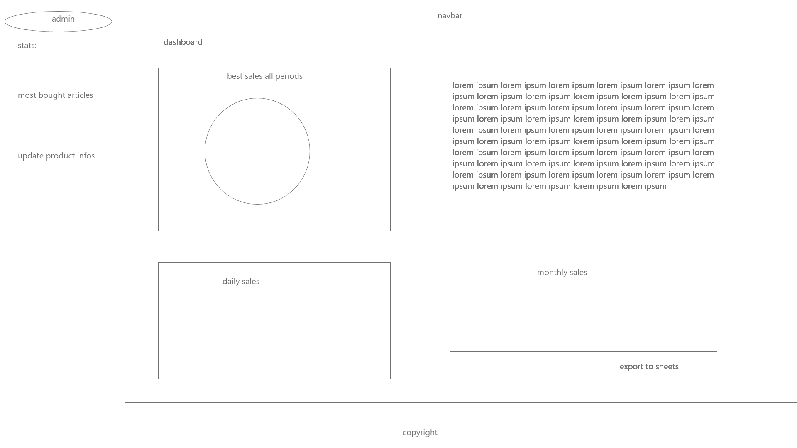
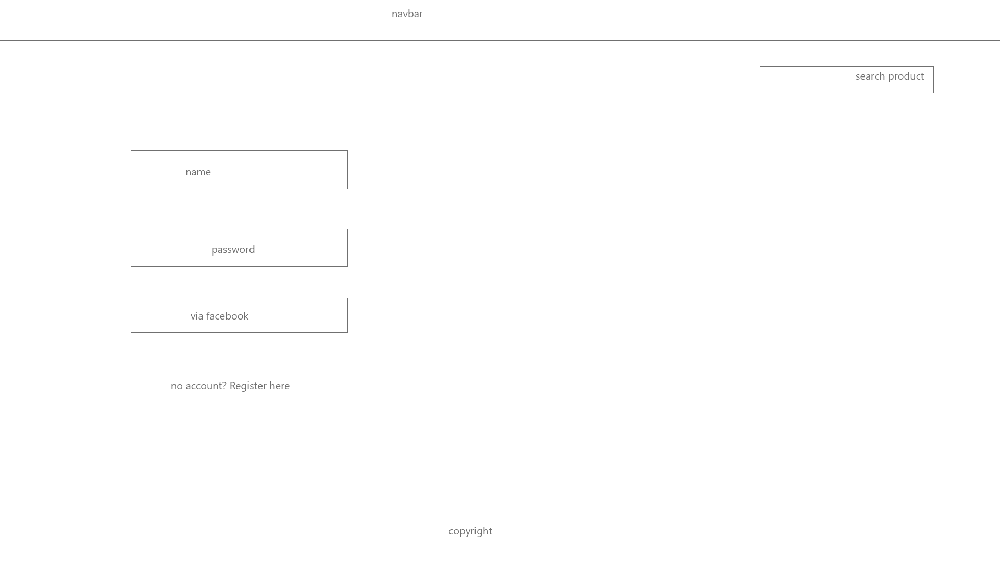
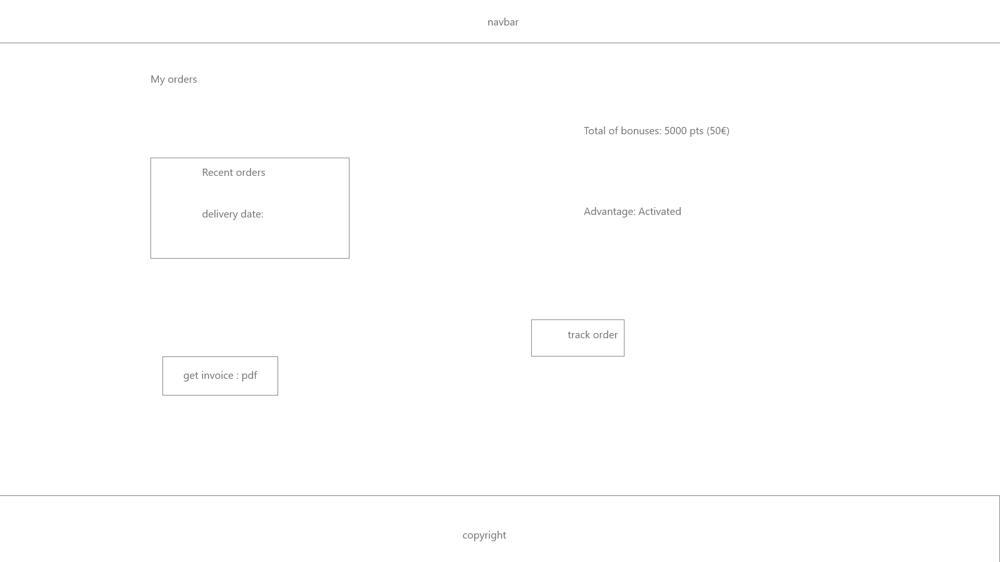
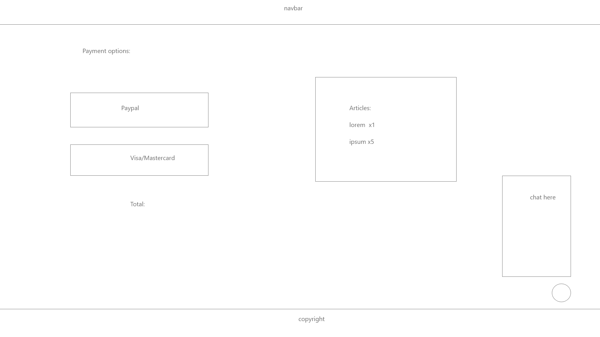
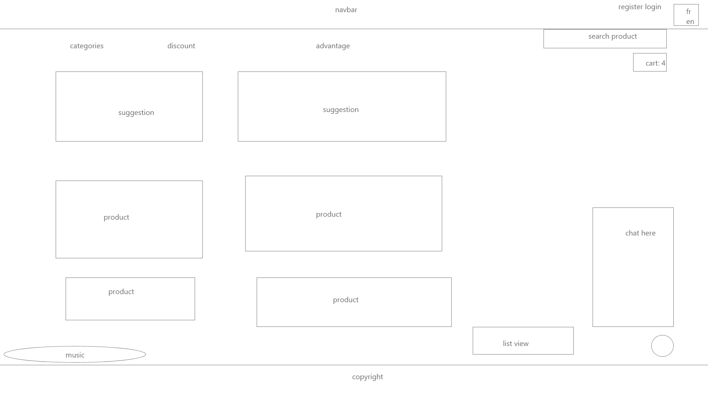
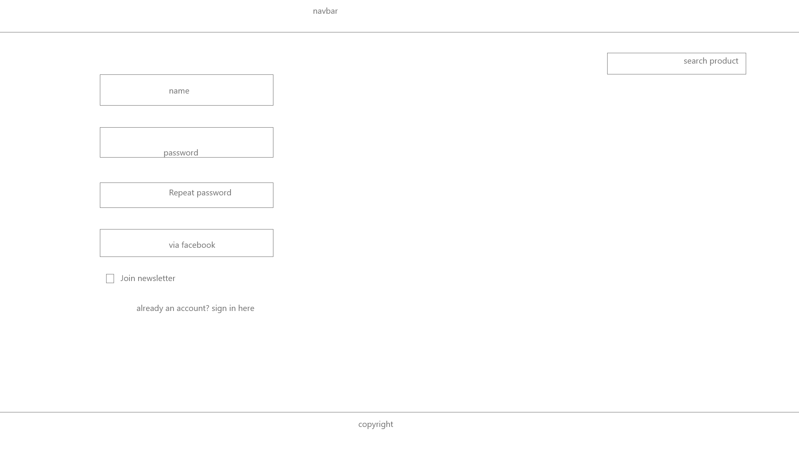